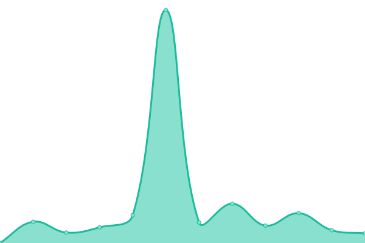
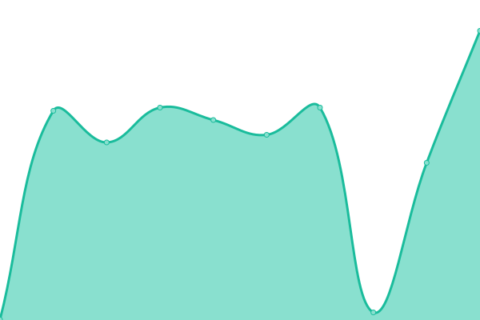
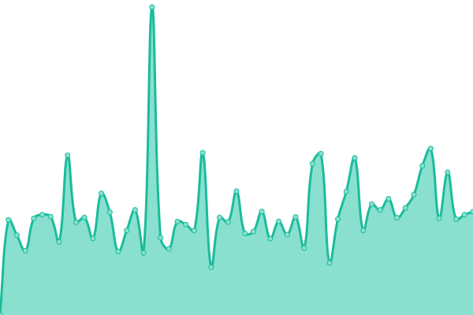
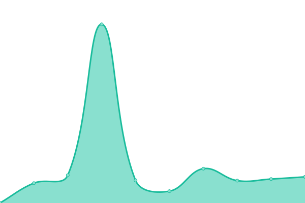
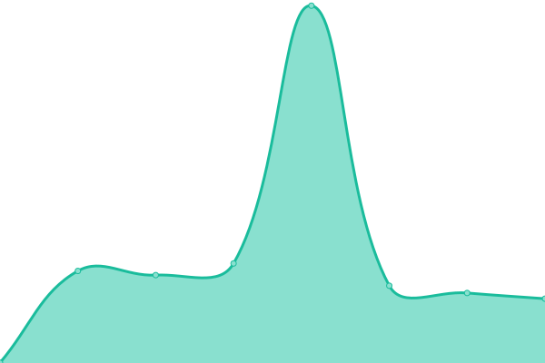

# [📈 Live Status](https://demo.upptime.js.org): <!--live status--> **🟧 Partial outage**

Hello and welcome to the Medical Informatics Status Database repository. As I explore chemical infinity online I often have misconnections or the resource is lost forever and also messes with my automation pipelines. In an attempt to keep track of the resources I use for myself I perform a heartbeat check to ensure they are still working. If you need it then just search the page and check the status. If the history is dead forever, links will be removed appropiately or into a deadlink category.

This repository contains the open-source uptime monitor and status page for [Suliman Sharif](https://demo.upptime.js.org), powered by [Upptime](https://github.com/upptime/upptime).

<!--start: status pages-->
<!-- This summary is generated by Upptime (https://github.com/upptime/upptime) -->
<!-- Do not edit this manually, your changes will be overwritten -->
<!-- prettier-ignore -->
| URL | Status | History | Response Time | Uptime |
| --- | ------ | ------- | ------------- | ------ |
|  [Center for Invivo Microscopy](http://www.civm.duhs.duke.edu/devatlas/) | 🟩 Up | [center-for-invivo-microscopy.yml](https://github.com/Sulstice/Uptime-Medical-Informatics/commits/HEAD/history/center-for-invivo-microscopy.yml) | 

 3199ms
     
 | 

<a href="https://medicinedb.org/history/center-for-invivo-microscopy">100.00%</a>
    

|  [Embrionic and Neonatal Mouse](http://www.civm.duhs.duke.edu/devatlas/UserGuide.pdf) | 🟥 Down | [embrionic-and-neonatal-mouse.yml](https://github.com/Sulstice/Uptime-Medical-Informatics/commits/HEAD/history/embrionic-and-neonatal-mouse.yml) | 

 362ms
     
 | 

<a href="https://medicinedb.org/history/embrionic-and-neonatal-mouse">0.00%</a>
    

|  [LONI image data archive](https://ida.loni.usc.edu/services/Menu/IdaData.jsp?project=) | 🟩 Up | [loni-image-data-archive.yml](https://github.com/Sulstice/Uptime-Medical-Informatics/commits/HEAD/history/loni-image-data-archive.yml) | 

 277ms
     
 | 

<a href="https://medicinedb.org/history/loni-image-data-archive">100.00%</a>
    

|  [Collaborative Informatics and Neuroimaging Suite](https://portal.mrn.org/micis/index.php?subsite=dx) | 🟥 Down | [collaborative-informatics-and-neuroimaging-suite.yml](https://github.com/Sulstice/Uptime-Medical-Informatics/commits/HEAD/history/collaborative-informatics-and-neuroimaging-suite.yml) | 

 0ms
     
 | 

<a href="https://medicinedb.org/history/collaborative-informatics-and-neuroimaging-suite">0.00%</a>
    

|  [The Cancer Imaging Archive](http://www.cancerimagingarchive.net/) | 🟩 Up | [the-cancer-imaging-archive.yml](https://github.com/Sulstice/Uptime-Medical-Informatics/commits/HEAD/history/the-cancer-imaging-archive.yml) | 

 977ms
     
 | 

<a href="https://medicinedb.org/history/the-cancer-imaging-archive">100.00%</a>
    

|  [Alzheimer’s Disease Neuroimaging Initiative](http://adni.loni.ucla.edu/) | 🟥 Down | [alzheimer-s-disease-neuroimaging-initiative.yml](https://github.com/Sulstice/Uptime-Medical-Informatics/commits/HEAD/history/alzheimer-s-disease-neuroimaging-initiative.yml) | 

 0ms
     
 | 

<a href="https://medicinedb.org/history/alzheimer-s-disease-neuroimaging-initiative">0.00%</a>
    

|  [The Open Access Series of Imaging Studies](http://www.oasis-brains.org/) | 🟩 Up | [the-open-access-series-of-imaging-studies.yml](https://github.com/Sulstice/Uptime-Medical-Informatics/commits/HEAD/history/the-open-access-series-of-imaging-studies.yml) | 

 885ms
     
 | 

<a href="https://medicinedb.org/history/the-open-access-series-of-imaging-studies">100.00%</a>
    

|  [Breast Cancer Digital Repository](https://bcdr.eu/) | 🟥 Down | [breast-cancer-digital-repository.yml](https://github.com/Sulstice/Uptime-Medical-Informatics/commits/HEAD/history/breast-cancer-digital-repository.yml) | 

 3298ms
     
 | 

<a href="https://medicinedb.org/history/breast-cancer-digital-repository">0.00%</a>
    

|  [DDSM Digital Database for Screening Mammography](http://marathon.csee.usf.edu/Mammography/Database.html) | 🟥 Down | [ddsm-digital-database-for-screening-mammography.yml](https://github.com/Sulstice/Uptime-Medical-Informatics/commits/HEAD/history/ddsm-digital-database-for-screening-mammography.yml) | 

 0ms
     
 | 

<a href="https://medicinedb.org/history/ddsm-digital-database-for-screening-mammography">0.00%</a>
    

|  [The Mammographic Image Analysis Society (MIAS) mini-database](http://peipa.essex.ac.uk/info/mias.html) | 🟩 Up | [the-mammographic-image-analysis-society-mias-mini-database.yml](https://github.com/Sulstice/Uptime-Medical-Informatics/commits/HEAD/history/the-mammographic-image-analysis-society-mias-mini-database.yml) | 

 708ms
     
 | 

<a href="https://medicinedb.org/history/the-mammographic-image-analysis-society-mias-mini-database">100.00%</a>
    

|  [NLM HyperDoc Visible Human Project color, CAT and MRI image samples](http://www.nlm.nih.gov/research/visible/visible_human.html) | 🟩 Up | [nlm-hyper-doc-visible-human-project-color-cat-and-mri-image-samples.yml](https://github.com/Sulstice/Uptime-Medical-Informatics/commits/HEAD/history/nlm-hyper-doc-visible-human-project-color-cat-and-mri-image-samples.yml) | 

 324ms
     
 | 

<a href="https://medicinedb.org/history/nlm-hyper-doc-visible-human-project-color-cat-and-mri-image-samples">100.00%</a>
    

|  [CT Scans for Colon Cancer](https://wiki.cancerimagingarchive.net/display/Public/CT+COLONOGRAPHY#e88604ec5c654f60a897fa77906f88a6) | 🟥 Down | [ct-scans-for-colon-cancer.yml](https://github.com/Sulstice/Uptime-Medical-Informatics/commits/HEAD/history/ct-scans-for-colon-cancer.yml) | 

 629ms
     
 | 

<a href="https://medicinedb.org/history/ct-scans-for-colon-cancer">0.00%</a>
    

|  [UTA4 Breast Cancer Medical Imaging DICOM Files Dataset & Resources](https://github.com/MIMBCD-UI/dataset-uta4-dicom) | 🟩 Up | [uta-4-breast-cancer-medical-imaging-dicom-files-dataset-and-resources.yml](https://github.com/Sulstice/Uptime-Medical-Informatics/commits/HEAD/history/uta-4-breast-cancer-medical-imaging-dicom-files-dataset-and-resources.yml) | 

 1821ms
     
 | 

<a href="https://medicinedb.org/history/uta-4-breast-cancer-medical-imaging-dicom-files-dataset-and-resources">100.00%</a>
    

|  [UTA7 Breast Cancer Medical Imaging DICOM Files Dataset & Resources](https://github.com/MIMBCD-UI/dataset-uta7-dicom) | 🟩 Up | [uta-7-breast-cancer-medical-imaging-dicom-files-dataset-and-resources.yml](https://github.com/Sulstice/Uptime-Medical-Informatics/commits/HEAD/history/uta-7-breast-cancer-medical-imaging-dicom-files-dataset-and-resources.yml) | 

 1632ms
     
 | 

<a href="https://medicinedb.org/history/uta-7-breast-cancer-medical-imaging-dicom-files-dataset-and-resources">100.00%</a>
    

|  [BCNB Early Breast Cancer Core-Needle Biopsy WSI Dataset](https://bupt-ai-cz.github.io/BCNB/, https://github.com/bupt-ai-cz/BALNMP#bcnb-dataset) | 🟥 Down | [bcnb-early-breast-cancer-core-needle-biopsy-wsi-dataset.yml](https://github.com/Sulstice/Uptime-Medical-Informatics/commits/HEAD/history/bcnb-early-breast-cancer-core-needle-biopsy-wsi-dataset.yml) | 

 0ms
     
 | 

<a href="https://medicinedb.org/history/bcnb-early-breast-cancer-core-needle-biopsy-wsi-dataset">100.00%</a>
    

|  [The Cancer Genome Atlas](https://tcga-data.nci.nih.gov/tcga/) | 🟩 Up | [the-cancer-genome-atlas.yml](https://github.com/Sulstice/Uptime-Medical-Informatics/commits/HEAD/history/the-cancer-genome-atlas.yml) | 

 1552ms
     
 | 

<a href="https://medicinedb.org/history/the-cancer-genome-atlas">100.00%</a>
    

|  [Stanford Tissue Microarray Database](http://tma.im) | 🟩 Up | [stanford-tissue-microarray-database.yml](https://github.com/Sulstice/Uptime-Medical-Informatics/commits/HEAD/history/stanford-tissue-microarray-database.yml) | 

 460ms
     
 | 

<a href="https://medicinedb.org/history/stanford-tissue-microarray-database">100.00%</a>
    

|  [MITOS dataset](http://www.ipal.cnrs.fr/event/icpr-2012) | 🟥 Down | [mitos-dataset.yml](https://github.com/Sulstice/Uptime-Medical-Informatics/commits/HEAD/history/mitos-dataset.yml) | 

 2878ms
     
 | 

<a href="https://medicinedb.org/history/mitos-dataset">0.08%</a>
    

|  [Cancer Image Database](https://emice.nci.nih.gov/caimage) | 🟥 Down | [cancer-image-database.yml](https://github.com/Sulstice/Uptime-Medical-Informatics/commits/HEAD/history/cancer-image-database.yml) | 

 699ms
     
 | 

<a href="https://medicinedb.org/history/cancer-image-database">0.00%</a>
    

|  [DPAs Whole Slide Imaging Repository](https://digitalpathologyassociation.org/whole-slide-imaging-repository) | 🟩 Up | [dp-as-whole-slide-imaging-repository.yml](https://github.com/Sulstice/Uptime-Medical-Informatics/commits/HEAD/history/dp-as-whole-slide-imaging-repository.yml) | 

 486ms
     
 | 

<a href="https://medicinedb.org/history/dp-as-whole-slide-imaging-repository">100.00%</a>
    

|  [ITK Analysis of Large Histology Datasets](http://www.na-mic.org/Wiki/index.php/ITK_Analysis_of_Large_Histology_Datasets) | 🟩 Up | [itk-analysis-of-large-histology-datasets.yml](https://github.com/Sulstice/Uptime-Medical-Informatics/commits/HEAD/history/itk-analysis-of-large-histology-datasets.yml) | 

 3202ms
     
 | 

<a href="https://medicinedb.org/history/itk-analysis-of-large-histology-datasets">98.47%</a>
    

|  [Histology Photo Album](http://www.histology-world.com/photoalbum/thumbnails.php?album=52) | 🟩 Up | [histology-photo-album.yml](https://github.com/Sulstice/Uptime-Medical-Informatics/commits/HEAD/history/histology-photo-album.yml) | 

 1194ms
     
 | 

<a href="https://medicinedb.org/history/histology-photo-album">100.00%</a>
    

|  [Slide Library of Virtual pathology, University of Leeds](http://www.virtualpathology.leeds.ac.uk/) | 🟥 Down | [slide-library-of-virtual-pathology-university-of-leeds.yml](https://github.com/Sulstice/Uptime-Medical-Informatics/commits/HEAD/history/slide-library-of-virtual-pathology-university-of-leeds.yml) | 

 1165ms
     
 | 

<a href="https://medicinedb.org/history/slide-library-of-virtual-pathology-university-of-leeds">100.00%</a>
    

|  [Aperio Images](http://images.aperio.com/) | 🟥 Down | [aperio-images.yml](https://github.com/Sulstice/Uptime-Medical-Informatics/commits/HEAD/history/aperio-images.yml) | 

 0ms
     
 | 

<a href="https://medicinedb.org/history/aperio-images">0.00%</a>
    

|  [HAPS Histology Image Database](http://hapshistology.wikifoundry.com/) | 🟥 Down | [haps-histology-image-database.yml](https://github.com/Sulstice/Uptime-Medical-Informatics/commits/HEAD/history/haps-histology-image-database.yml) | 

 0ms
     
 | 

<a href="https://medicinedb.org/history/haps-histology-image-database">0.00%</a>
    

|  [BDGP images from the FlyExpress database](www.flyexpress.net) | 🟩 Up | [bdgp-images-from-the-fly-express-database.yml](https://github.com/Sulstice/Uptime-Medical-Informatics/commits/HEAD/history/bdgp-images-from-the-fly-express-database.yml) | 

 267ms
     
 | 

<a href="https://medicinedb.org/history/bdgp-images-from-the-fly-express-database">100.00%</a>
    

|  [The UCSB Bio-Segmentation Benchmark dataset](http://www.bioimage.ucsb.edu/research/biosegmentation) | 🟩 Up | [the-ucsb-bio-segmentation-benchmark-dataset.yml](https://github.com/Sulstice/Uptime-Medical-Informatics/commits/HEAD/history/the-ucsb-bio-segmentation-benchmark-dataset.yml) | 

 837ms
     
 | 

<a href="https://medicinedb.org/history/the-ucsb-bio-segmentation-benchmark-dataset">100.00%</a>
    

|  [Pap Smear database](http://mde-lab.aegean.gr/index.php/downloads) | 🟩 Up | [pap-smear-database.yml](https://github.com/Sulstice/Uptime-Medical-Informatics/commits/HEAD/history/pap-smear-database.yml) | 

 3335ms
     
 | 

<a href="https://medicinedb.org/history/pap-smear-database">100.00%</a>
    

|  [Histology (CIMA) dataset](http://cmp.felk.cvut.cz/~borovji3/?page=dataset) | 🟥 Down | [histology-cima-dataset.yml](https://github.com/Sulstice/Uptime-Medical-Informatics/commits/HEAD/history/histology-cima-dataset.yml) | 

 2297ms
     
 | 

<a href="https://medicinedb.org/history/histology-cima-dataset">0.00%</a>
    

|  [ANHIR dataset](https://anhir.grand-challenge.org/) | 🟩 Up | [anhir-dataset.yml](https://github.com/Sulstice/Uptime-Medical-Informatics/commits/HEAD/history/anhir-dataset.yml) | 

 841ms
     
 | 

<a href="https://medicinedb.org/history/anhir-dataset">100.00%</a>
    

|  [Genome RNAi dataset](hhttp://www.genomernai.org/) | 🟥 Down | [genome-rn-ai-dataset.yml](https://github.com/Sulstice/Uptime-Medical-Informatics/commits/HEAD/history/genome-rn-ai-dataset.yml) | 

 0ms
     
 | 

<a href="https://medicinedb.org/history/genome-rn-ai-dataset">0.00%</a>
    

|  [Chinese Hamster Ovary cells (CHO) dataset](http://www.chogenome.org/data.html) | 🟩 Up | [chinese-hamster-ovary-cells-cho-dataset.yml](https://github.com/Sulstice/Uptime-Medical-Informatics/commits/HEAD/history/chinese-hamster-ovary-cells-cho-dataset.yml) | 

 553ms
     
 | 

<a href="https://medicinedb.org/history/chinese-hamster-ovary-cells-cho-dataset">100.00%</a>
    

|  [Locate Endogenus mouse sub-cellular organelles (END) database](http://locate.imb.uq.edu.au/) | 🟥 Down | [locate-endogenus-mouse-sub-cellular-organelles-end-database.yml](https://github.com/Sulstice/Uptime-Medical-Informatics/commits/HEAD/history/locate-endogenus-mouse-sub-cellular-organelles-end-database.yml) | 

 0ms
     
 | 

<a href="https://medicinedb.org/history/locate-endogenus-mouse-sub-cellular-organelles-end-database">100.00%</a>
    

|  [2D HeLa dataset (HeLa) dataset](https://ome.grc.nia.nih.gov/iicbu2008/hela/index.html) | 🟥 Down | [2-d-he-la-dataset-he-la-dataset.yml](https://github.com/Sulstice/Uptime-Medical-Informatics/commits/HEAD/history/2-d-he-la-dataset-he-la-dataset.yml) | 

 0ms
     
 | 

<a href="https://medicinedb.org/history/2-d-he-la-dataset-he-la-dataset">0.00%</a>
    

|  [Allen Brain Atlas](http://www.brain-map.org/) | 🟩 Up | [allen-brain-atlas.yml](https://github.com/Sulstice/Uptime-Medical-Informatics/commits/HEAD/history/allen-brain-atlas.yml) | 

 925ms
     
 | 

<a href="https://medicinedb.org/history/allen-brain-atlas">100.00%</a>
    

|  [1000 Functional Connectomes Project](http://fcon_1000.projects.nitrc.org/) | 🟩 Up | [1000-functional-connectomes-project.yml](https://github.com/Sulstice/Uptime-Medical-Informatics/commits/HEAD/history/1000-functional-connectomes-project.yml) | 

 341ms
     
 | 

<a href="https://medicinedb.org/history/1000-functional-connectomes-project">100.00%</a>
    

|  [The Cell Centered Database](https://library.ucsd.edu/dc/collection/bb5940732k) | 🟩 Up | [the-cell-centered-database.yml](https://github.com/Sulstice/Uptime-Medical-Informatics/commits/HEAD/history/the-cell-centered-database.yml) | 

 747ms
     
 | 

<a href="https://medicinedb.org/history/the-cell-centered-database">100.00%</a>
    

|  [The Encyclopedia of DNA Elements](http://genome.ucsc.edu/ENCODE/) | 🟩 Up | [the-encyclopedia-of-dna-elements.yml](https://github.com/Sulstice/Uptime-Medical-Informatics/commits/HEAD/history/the-encyclopedia-of-dna-elements.yml) | 

 4797ms
     
 | 

<a href="https://medicinedb.org/history/the-encyclopedia-of-dna-elements">100.00%</a>
    

|  [The Human Protein Atlas](http://www.proteinatlas.org/) | 🟩 Up | [the-human-protein-atlas.yml](https://github.com/Sulstice/Uptime-Medical-Informatics/commits/HEAD/history/the-human-protein-atlas.yml) | 

 2805ms
     
 | 

<a href="https://medicinedb.org/history/the-human-protein-atlas">100.00%</a>
    

|  [DRIVE Digital Retinal Images for Vessel Extraction](http://www.isi.uu.nl/Research/Databases/DRIVE/) | 🟥 Down | [drive-digital-retinal-images-for-vessel-extraction.yml](https://github.com/Sulstice/Uptime-Medical-Informatics/commits/HEAD/history/drive-digital-retinal-images-for-vessel-extraction.yml) | 

 0ms
     
 | 

<a href="https://medicinedb.org/history/drive-digital-retinal-images-for-vessel-extraction">0.00%</a>
    

|  [El Salvador Atlas of Gastrointestinal VideoEndoscopy Images and Videos of hi-res of studies taken from Gastrointestinal Video endoscopy](http://www.gastrointestinalatlas.com/) | 🟩 Up | [el-salvador-atlas-of-gastrointestinal-video-endoscopy-images-and-videos-of-hi-res-of-studies-taken-from-gastrointestinal-video-endoscopy.yml](https://github.com/Sulstice/Uptime-Medical-Informatics/commits/HEAD/history/el-salvador-atlas-of-gastrointestinal-video-endoscopy-images-and-videos-of-hi-res-of-studies-taken-from-gastrointestinal-video-endoscopy.yml) | 

 357ms
     
 | 

<a href="https://medicinedb.org/history/el-salvador-atlas-of-gastrointestinal-video-endoscopy-images-and-videos-of-hi-res-of-studies-taken-from-gastrointestinal-video-endoscopy">100.00%</a>
    

|  [BCNB Early Breast Cancer Core-Needle Biopsy WSI Dataset](https://bupt-ai-cz.github.io/BCNB/, https://github.com/bupt-ai-cz/BALNMP#bcnb-dataset) | 🟥 Down | [bcnb-early-breast-cancer-core-needle-biopsy-wsi-dataset.yml](https://github.com/Sulstice/Uptime-Medical-Informatics/commits/HEAD/history/bcnb-early-breast-cancer-core-needle-biopsy-wsi-dataset.yml) | 

 0ms
     
 | 

<a href="https://medicinedb.org/history/bcnb-early-breast-cancer-core-needle-biopsy-wsi-dataset">100.00%</a>
    

|  [DermNet - Skin disease atlas](http://www.dermnet.com/) | 🟩 Up | [derm-net-skin-disease-atlas.yml](https://github.com/Sulstice/Uptime-Medical-Informatics/commits/HEAD/history/derm-net-skin-disease-atlas.yml) | 

 292ms
     
 | 

<a href="https://medicinedb.org/history/derm-net-skin-disease-atlas">100.00%</a>
    

<!--end: status pages-->

[**Visit our status website →**](https://medicinedb.org)

## 📄 License

- Powered by: [Upptime](https://github.com/upptime/upptime)
- Code: [MIT](./LICENSE) © [Sul ](https://www.sulstice.dev/)
- Data in the `./history` directory: [Open Database License](https://opendatacommons.org/licenses/odbl/1-0/)
